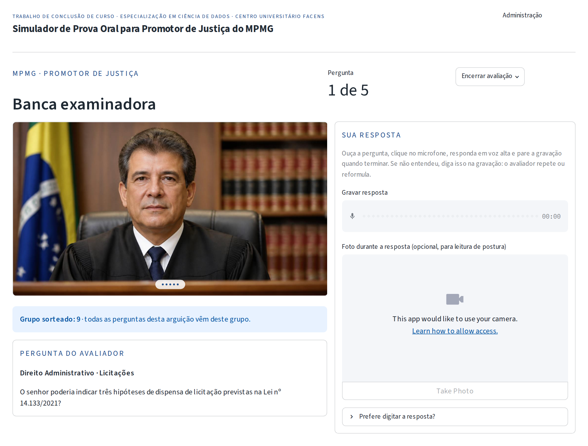
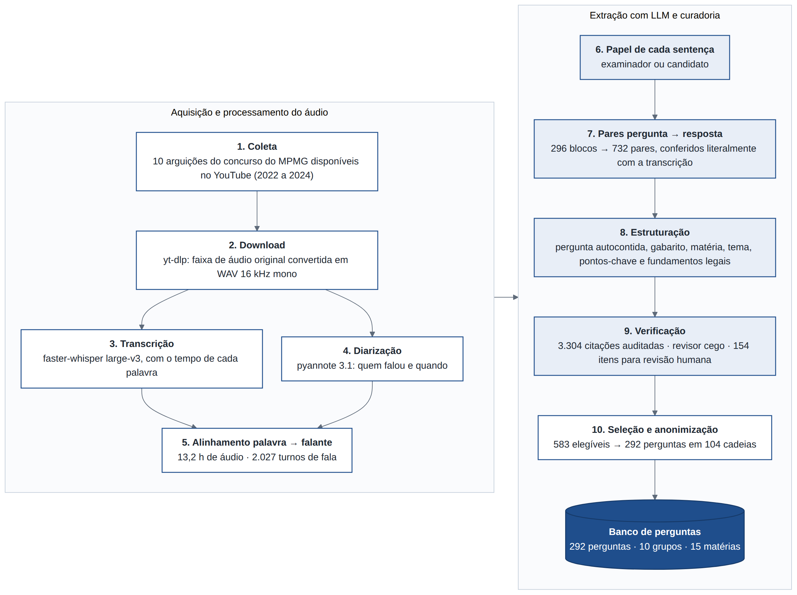
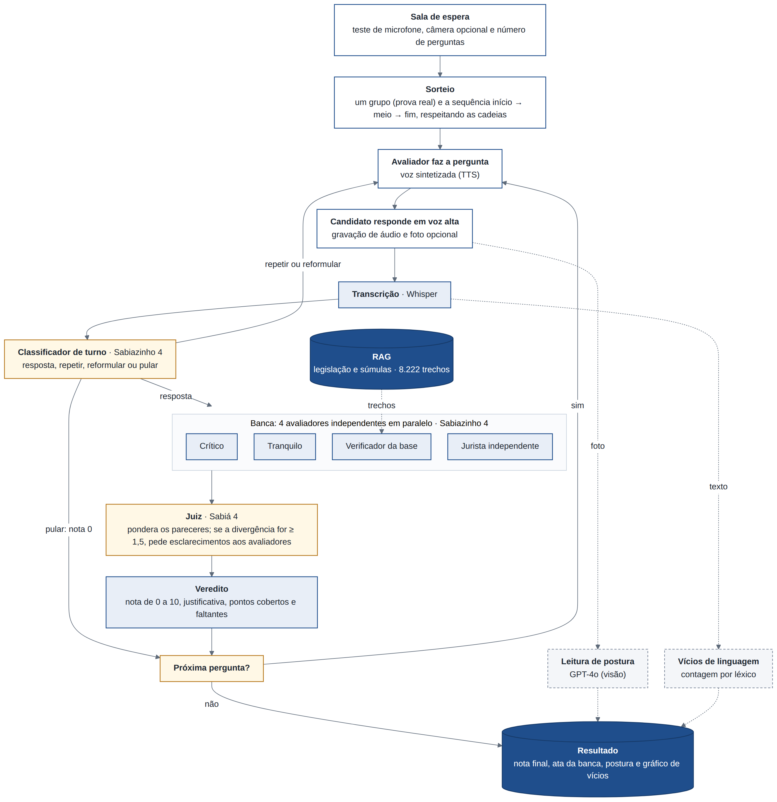
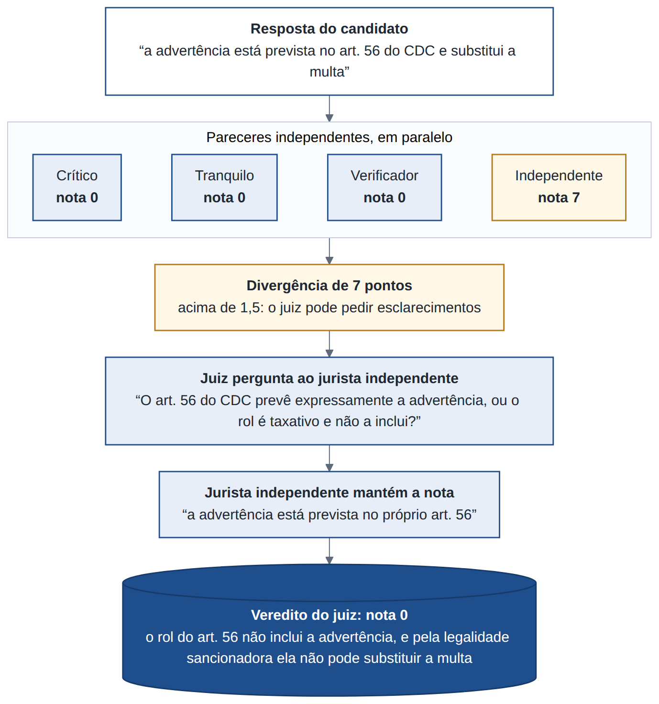

<div align="center">

# ⚖️ Simulador de Prova Oral para Promotor de Justiça do MPMG

**Trabalho de Conclusão de Curso · Especialização em Ciência de Dados · Centro Universitário Facens · 2026**


### [▶ Acessar o simulador](https://tcc-ciencia-de-dados-arua.streamlit.app/) · [Como rodar](#-como-rodar-localmente)



</div>

---

## 📌 Sobre o trabalho

A prova oral é uma das etapas finais e mais importantes de alguns concursos públicos, e uma das mais
difíceis de treinar: o candidato raramente tem acesso a alguém que faça o papel de examinador, faça as
perguntas e avalie as respostas.

Este projeto cria um **simulador de prova oral para o concurso de Promotor de Justiça do Ministério
Público de Minas Gerais (MPMG)** construído a partir de **provas reais**. Um *pipeline* de ciência de
dados transcreveu 10 arguições, separou as falas de examinadores e candidatos e transformou a conversa
em um banco de perguntas com gabarito. No simulador, o avaliador faz as perguntas por voz, o candidato
responde falando e uma **banca de agentes de IA** avalia a resposta e justifica a nota.

| | |
|---|---|
| **Autor** | Aruã Puertas Costa |
| **Orientador** | Adriano Valério Santos Silva |
| **Instituição** | Centro Universitário Facens, Sorocaba, SP |
| **Curso** | Especialização em Ciência de Dados |
| **Natureza** | Protótipo acadêmico, sem fins comerciais |

## 📊 Em números

| Dado | Valor |
|---|---|
| Arguições reais analisadas | 10 (edições LVIII/2022, LIX/2023 e LX/2024) |
| Áudio transcrito | 13,2 horas · 100 mil palavras · 2.027 turnos de fala |
| Pares de pergunta e resposta extraídos | 732 |
| Perguntas no banco final | **292**, em 15 matérias e 10 grupos de prova |
| Base de legislação e súmulas (RAG) | 8.222 trechos |
| Agentes de IA | 7 (classificador, 4 avaliadores, juiz e leitor de postura) |
| Custo de uma simulação de 5 perguntas | cerca de US$ 0,05 |

## 🔎 Como funciona

### 1. Do vídeo ao banco de perguntas

<div align="center"></div>

1. **Coleta e download:** 10 arguições do concurso no YouTube; só o áudio, com `yt-dlp` e `ffmpeg`.
2. **Transcrição:** `faster-whisper` (Whisper large-v3) em GPU, com o tempo de cada palavra.
3. **Quem falou:** diarização com `pyannote 3.1`, cruzada palavra a palavra com a transcrição, e um LLM
   que indica se cada trecho é do examinador ou do candidato.
4. **Perguntas e gabaritos:** um LLM encontra os pares de pergunta e resposta, e outro reescreve a
   pergunta para fazer sentido sozinha e escreve gabarito, pontos-chave e fundamentos legais.
5. **Revisão:** conferência automática das citações de lei, revisor cego por LLM e fila de revisão humana.
   Das 732 perguntas extraídas, ficaram as 292 mais completas e seguras, já sem dados pessoais.

O código está em [`src/pipeline de criação de banco de perguntas/`](src/pipeline%20de%20cria%C3%A7%C3%A3o%20de%20banco%20de%20perguntas/).

### 2. A simulação

<div align="center"></div>

- O sistema sorteia um **grupo** (uma prova real) e monta a arguição na ordem início → meio → fim,
  mantendo juntas a pergunta principal e os desdobramentos.
- O avaliador lê cada pergunta com **voz sintetizada**; o candidato **grava a resposta** (ou digita).
- O **classificador de turno** decide se a fala é resposta, pedido para repetir, para reformular ou
  para pular. Só a resposta de mérito vai para a banca.
- No fim, o candidato recebe um **relatório**: indicadores (nota, pontos-chave cobertos, perguntas
  puladas, vícios de linguagem e tempo), gráficos da evolução da nota ao longo da arguição, do desempenho
  por matéria e dos vícios em cada pergunta, a justificativa de cada resposta, a **ata da banca** e, se
  tirou foto, um resumo da postura.

### 3. A banca de agentes

| Agente | Modelo | Função | O que recebe |
|---|---|---|---|
| Classificador de turno | Sabiazinho 4 | Decide se a fala é resposta, repetição, reformulação, conversa ou pular | Pergunta e fala transcrita |
| Avaliador crítico | Sabiazinho 4 | Cobra precisão técnica e fundamentação | Gabarito, pontos-chave e fundamentos |
| Avaliador tranquilo | Sabiazinho 4 | Valoriza o raciocínio e separa lacuna de erro | Gabarito e pontos-chave |
| Verificador da base | Sabiazinho 4 | Confere cada afirmação com a legislação | Gabarito, fundamentos e trechos do RAG |
| Jurista independente | Sabiazinho 4 | Avalia só com o próprio conhecimento | Só a pergunta e a resposta |
| Juiz | Sabiá 4 | Pondera os pareceres, pede esclarecimentos e dá a nota | Todo o material e os 4 pareceres |
| Leitor de postura | GPT-4o | Estima nervosismo, confiança e indícios de leitura | Foto da resposta |

Os quatro avaliadores rodam em paralelo, sem ver o parecer uns dos outros. Quando as notas divergem
1,5 ponto ou mais, o juiz pode **perguntar diretamente a um avaliador** antes de decidir. Exemplo real
da simulação de demonstração, em que o jurista independente errou e o juiz investigou:

<div align="center"></div>

## 🧰 Tecnologias

| Camada | Ferramentas |
|---|---|
| Interface e gráficos | Streamlit e Altair |
| Agentes | Agno, com saída estruturada em Pydantic |
| Modelos de texto | Maritaca AI (Sabiá 4 e Sabiazinho 4), treinados para o português |
| Fala, voz, visão e embeddings | OpenAI (Whisper, gpt-4o-mini-tts, GPT-4o, text-embedding-3-small) |
| Banco e busca vetorial | ChromaDB (Chroma Cloud em produção) |
| Pipeline de extração | yt-dlp, ffmpeg, faster-whisper, pyannote, GPT-5.5 e GPT-5.6 (Batch API) |

## 🗂️ Estrutura do repositório

```
app.py                       entrada do Streamlit (navegação)
paginas/                     home, concursos, sala, prova, resultado, login e painel admin
simulador/                   núcleo, sem dependência do Streamlit
  agentes.py                 agentes Agno: turno, postura e banca (avaliadores + juiz)
  banca.py                   personas, esquemas Pydantic e regras da deliberação
  personas.py                textos padrão de todos os prompts (editáveis no painel)
  simulacao.py               sorteio, sequência da arguição, resposta, finalização e resultado
  vicios.py                  léxico de vícios de linguagem
  relatorio.py               indicadores e tabelas do relatório de resultado
  db.py · esquema.py         acesso ao ChromaDB e esquema das coleções
  ia.py                      OpenAI: embeddings, Whisper e TTS
  ui/                        cabeçalho, rodapé, avatar, gráficos do resultado e dados do TCC (projeto.py)
db/                          criar coleções, importar, anonimizar, amostrar e copiar para a nuvem
banco de questoes finais/    as 292 perguntas (anonimizadas) e uma amostra de 40
src/pipeline de criação de banco de perguntas/   pipeline de extração (notebook único)
tests/                       28 testes com pytest
docs/img/                    imagens deste README
```

## 💻 Como rodar localmente

Requer Python 3.12 ou mais recente, uma chave da **Maritaca AI** e uma da **OpenAI**.

```bash
python -m venv .venv && source .venv/bin/activate
pip install -r requirements.txt
cp .streamlit/secrets.toml.example .streamlit/secrets.toml   # preencha senhas e chaves
python db/inicializar.py                                     # cria as coleções em ./dados/chroma
streamlit run app.py
```

Depois entre em **Administração** com `ADMIN_USUARIO` e `ADMIN_SENHA`, confira as chaves de API
(também podem ser cadastradas pelo painel) e importe o banco de questões na aba **Importar**.

> Use o **Chrome** ou o **Edge**. O gravador de áudio do Streamlit pode falhar em outros navegadores,
> e o microfone só é liberado em `localhost` ou em HTTPS.

<details>
<summary><b>Publicar no Streamlit Community Cloud</b></summary>

O disco do Community Cloud é apagado a cada reinício, então o banco precisa ficar no
[Chroma Cloud](https://www.trychroma.com) (o plano gratuito basta).

1. Crie a base no Chroma Cloud e anote `CHROMA_API_KEY`, `CHROMA_TENANT` e `CHROMA_DATABASE`.
2. Popule a base a partir da sua máquina. Se o banco já está montado localmente, copie-o com os
   vetores, sem chamar a OpenAI de novo:

   ```bash
   python db/copiar_para_nuvem.py            # ou: python db/importar_banco.py --vetorizar
   ```

3. Em [share.streamlit.io](https://share.streamlit.io), crie o app a partir deste repositório, com
   arquivo principal `app.py`.
4. Em *Settings → Secrets*, cole:

   ```toml
   ADMIN_USUARIO = "..."
   ADMIN_SENHA = "..."
   CHAVES_CRIPTO_SECRET = "uma-frase-longa-e-aleatoria"
   MARITACA_API_KEY = "..."
   OPENAI_API_KEY = "sk-..."
   CHROMA_API_KEY = "ck-..."
   CHROMA_TENANT = "..."
   CHROMA_DATABASE = "..."
   ```

5. Abra o painel e confira, na aba **Bases de conhecimento**, que o banco aparece como Chroma Cloud.

`CHAVES_CRIPTO_SECRET` cifra as chaves guardadas pelo painel: trocá-lo depois invalida as já salvas.
</details>

<details>
<summary><b>Testes</b></summary>

```bash
python -m pytest tests -q
```

Os testes usam um banco temporário. `tests/conftest.py` impede que eles alcancem o Chroma Cloud mesmo
quando o `secrets.toml` local aponta para ele.
</details>

<details>
<summary><b>Notas técnicas</b></summary>

- **Saída estruturada na Maritaca:** a API só aceita esquema JSON pela Responses API, não pelo
  `response_format` do Chat Completions. O modelo `Maritaca` em `simulador/agentes.py` põe o esquema no
  prompt de sistema e converte o texto devolvido; o *function calling* que o juiz usa funciona normalmente.
- **Duas bases isoladas:** a legislação (`material_chunks`) é a única consultada durante a prova; os
  gabaritos (`gabarito_chunks`) ficam em outra coleção, para nunca aparecerem como contexto na avaliação
  de outra pergunta.
- **Limites do Chroma Cloud:** cada leitura devolve no máximo 300 registros, então toda leitura de
  várias linhas é paginada; e documentos acima de 16 KiB são recusados, então registros acima de 12 KiB
  são gravados comprimidos (a ata de uma resposta longa pode passar disso).
- **Painel administrativo:** estatísticas, sessões, custos por provedor, modelos de cada agente,
  chaves de API cifradas, concursos, perguntas, bases de conhecimento e edição dos prompts dos 7
  agentes, com a prévia exata do que vai ao modelo.
</details>

## 🔒 Banco de questões e privacidade

As 292 perguntas vêm de arguições orais reais do concurso. O arquivo distribuído aqui é
**anonimizado**: ficam a pergunta, o gabarito, os pontos-chave, os fundamentos legais, a matéria, o tema
e o encadeamento entre pergunta principal e desdobramentos. Não ficam a transcrição literal da fala dos
candidatos, a colocação de cada um no concurso, a reação do examinador nem a referência ao vídeo. O
importador (`simulador/banco_questoes.py`) descarta esses campos mesmo que apareçam num arquivo enviado
pelo painel. Ver `db/anonimizar_banco.py`.

Para testes rápidos há uma amostra em `banco de questoes finais/banco_amostra.json` (40 questões, 4
provas de 10), gerada por `db/amostra_banco.py`.

## 🚀 Limitações e próximos passos

O projeto fica aberto para quem quiser dar sequência. O que já está mapeado:

- [ ] Testar com candidatos reais quando o concurso abrir e comparar as notas da banca com as de examinadores humanos.
- [ ] Medir a acurácia da separação examinador/candidato com a amostra de 80 turnos já separada para anotação.
- [ ] Repetir a avaliação da mesma resposta várias vezes para medir a consistência das notas.
- [ ] Ampliar a base de conhecimento com a legislação especial cobrada na prova (Lei de Licitações, CDC, ECA…).
- [ ] Revisar os 154 itens que ficaram na fila de revisão humana, para aumentar o banco.
- [ ] Trocar as fotos por análise de vídeo contínuo.
- [ ] Usar a versão 2 do pipeline, já generalizada, para montar bancos de outros concursos com prova oral.

## 📚 Como citar

COSTA, A. P. *Simulador de prova oral para Promotor de Justiça do MPMG*: código-fonte do simulador e do
pipeline de extração. 2026. Trabalho de Conclusão de Curso (Especialização em Ciência de Dados),
Centro Universitário Facens, Sorocaba, 2026. Disponível em: https://github.com/arupuertas/tcc-ciencia-de-dados.
